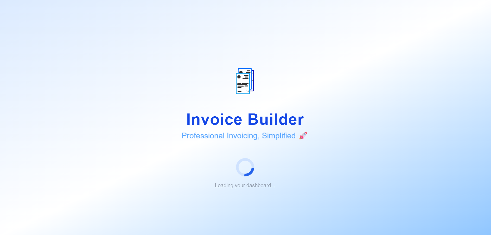

# 🧾 Invoice Builder

A **clean, professional web application** to **create, manage, and export invoices** for any business or freelancer — built with **ReactJS**, **Tailwind CSS**, and **localForage** for offline storage. Generate modern PDF invoices, track clients, products, and much more — all in a beautiful, responsive dashboard.

---

## ✨ Features

- 📝 **Create, edit, and view invoices** with ease
- 📤 **Export invoices** (PDF download & preview)
- 🏢 **Business profile**: Upload logo, banner & business details
- 👥 **Client management**: Add, edit, select, and autofill client info
- 📦 **Product management**: Save, edit, reuse products in invoices
- 🧮 **Automatic calculation**: Real-time totals, taxes, fees & grand total
- 🗂 **Invoice status**: Draft, Paid, Unpaid tracking
- 🏷 **Custom invoice numbers**
- 🟢 **Mobile-first, fully responsive UI**
- 🔍 **Fast search & filter for invoices**
- 🗑 **Delete/edit invoices, clients, products**
- ♿️ **Accessible** design
- ⏱ **Splash screen** for professional loading experience
- 🔔 **Notifications** with react-toastify
- 📦 Data stored locally using **localForage** for fast, offline access

---

## 💡 Note:
The currency dropdown is currently for display purposes only—it changes the currency symbol in the form, but does not update the currency symbol or formatting in the totals, tables, or input fields. Currency selection does not affect calculations or amounts throughout the app.

---

## ⚙️ Tech Stack

- ⚛ **ReactJS** + Context API (state management)
- 🎨 **Tailwind CSS** (UI styling)
- 💾 **localForage** (browser offline storage)
- 🖨 **jsPDF** & **html2canvas** (PDF export)
- 🔔 **react-toastify** (notifications)
- 🧑‍💻 **Lucide-react** (icons)
- 🏷 **React Router** (routing)

---

## 📂 Project Structure

📦 InvoiceBuilder
┣ 📂 src
┃ ┣ 📂 assets/
┃ ┣ 📂 components
┃ ┃ ┣ business/
┃ ┃ ┣ invoices/
┃ ┃ ┣ clients/
┃ ┃ ┣ products/
┃ ┃ ┣ Layout/
┃ ┣ 📂 context
┃ ┣ 📂 pages
┃ ┣ 📂 utils
┃ ┣ App.jsx
┃ ┣ index.css
┃ ┣ main.jsx
┃ ┣ ...
┣ package.json
┗ README.md

---

## ❓ Why This Project?

- 🚀 Practice with React Context, hooks, state management

- 🧩 Showcases reusable, modular component design

- 💼 Real-world mini project for your resume/portfolio

---

## 🤝 What I Learned

- 🗃️ Mastered React Context API and modular component architecture.

- 📄 Implemented PDF export in a real app (jsPDF, html2canvas)

- 🖼️ Practiced clean, accessible UI with Tailwind CSS.

- 📱 Built for mobile-first and 💻 desktop—learned responsive techniques.

- 🗃️ Used localForage for browser-based offline data storage.

## 📸 Screenshots

---
